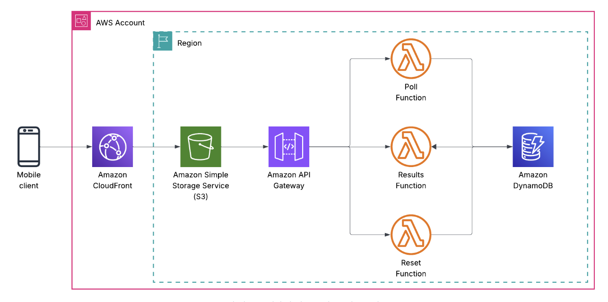

# Cloud Survey Application

A serverless survey application built with AWS services to demonstrate modern cloud architecture patterns and full-stack development.



## 🎯 Overview

This project showcases a complete serverless web application deployed on AWS. Users can vote on their preferred cloud provider, view live results, and administrators can reset the survey data. The entire infrastructure is defined as code using Terraform, making it reproducible and easy to deploy.

**Live Demo Features:**
- 🗳️ Real-time voting system
- 📊 Live results visualization with Chart.js
- 🔄 Admin reset functionality
- ⚡ Serverless architecture (no servers to manage)
- 🌐 Global content delivery via CloudFront CDN

## 🏗️ Architecture

The application follows a serverless, event-driven architecture pattern:

### Components

**Frontend (Static Website)**
- HTML5 pages hosted on S3
- JavaScript for interactive features
- CSS for responsive design
- Delivered globally via CloudFront CDN

**Backend (Serverless)**
- API Gateway for REST endpoints
- Lambda functions for business logic
- DynamoDB for data persistence

**Infrastructure**
- Terraform for Infrastructure as Code
- AWS IAM for security and permissions
- CloudFront for HTTPS and caching

### Data Flow

1. **Vote Submission**: User clicks vote → API Gateway → Lambda → DynamoDB
2. **Results Retrieval**: Page loads → API calls `/results` → Lambda scans table → Returns vote counts
3. **Admin Reset**: Admin confirms → API calls `/reset` → Lambda deletes all records

## 📁 Project Structure

```
.
├── diagram.png          # Architecture diagram
├── README.md           # This file
├── website/            # Frontend files
│   ├── index.html      # Voting page
│   ├── results.html    # Live results chart
│   ├── reset.html      # Admin reset page
│   ├── main.js         # JavaScript logic
│   └── style.css       # Styling
├── backend/            # Lambda functions
│   ├── vote.py         # Process vote submissions
│   ├── results.py      # Retrieve vote counts
│   └── reset.py        # Clear all data
└── terraform/          # Infrastructure as Code
    ├── main.tf         # AWS resource definitions
    ├── variables.tf    # Configuration variables
    └── outputs.tf      # Deployment outputs
```

## 🚀 Quick Start

### Prerequisites

- AWS Account ([Create one here](https://aws.amazon.com))
- AWS CLI installed and configured
- Terraform installed ([Download here](https://terraform.io))

### Deployment

1. **Configure AWS credentials:**
   ```bash
   aws configure
   ```

2. **Deploy the infrastructure:**
   ```bash
   cd terraform
   terraform init
   terraform apply
   ```

3. **Access your application:**
   After deployment, Terraform will output the CloudFront URL:
   ```
   cloudfront_domain = "https://d1234567890.cloudfront.net"
   ```

### Cleanup

To avoid AWS charges, destroy all resources when done:
```bash
cd terraform
terraform destroy
```

## 🔧 Technologies Used

### AWS Services

| Service | Purpose |
|---------|---------|
| **Lambda** | Serverless compute for backend logic |
| **API Gateway** | REST API endpoints |
| **DynamoDB** | NoSQL database for vote storage |
| **S3** | Static website hosting |
| **CloudFront** | CDN for global content delivery |
| **IAM** | Security and access management |

### Development Stack

- **Python 3.9** - Lambda runtime
- **boto3** - AWS SDK for Python
- **Terraform** - Infrastructure as Code
- **Chart.js** - Data visualization
- **Vanilla JavaScript** - Frontend interactivity

## 📚 Learning Objectives

This project demonstrates:

### Cloud Concepts
- ✅ Serverless computing
- ✅ Event-driven architecture
- ✅ Infrastructure as Code
- ✅ NoSQL databases
- ✅ CDN and global distribution
- ✅ RESTful API design

### Development Skills
- ✅ Full-stack development
- ✅ API integration
- ✅ Asynchronous JavaScript
- ✅ Error handling
- ✅ Git version control

### AWS Best Practices
- ✅ Least privilege IAM roles
- ✅ CORS configuration
- ✅ Environment variables
- ✅ Resource tagging
- ✅ HTTPS enforcement

## 💡 Extending the Project

### Beginner
- Modify the survey question
- Add custom vote options
- Change the color scheme

### Intermediate
- Add vote timestamps
- Implement rate limiting
- Create email notifications
- Export results to CSV

### Advanced
- Add user authentication (Cognito)
- Implement real-time updates (WebSockets)
- Add analytics dashboard
- Multi-region deployment
- CI/CD pipeline with GitHub Actions

## 🐛 Troubleshooting

**403 Forbidden Error**
- Verify S3 bucket policy allows CloudFront access
- Ensure files are uploaded to S3
- Check CloudFront distribution status

**Votes Not Saving**
- Check browser console for errors
- Verify API endpoints in `main.js`
- Review Lambda CloudWatch logs
- Confirm DynamoDB table permissions

**Chart Not Updating**
- Inspect network requests in DevTools
- Test API endpoints directly
- Verify CORS configuration

## 🔐 Security Considerations

⚠️ **This is an educational project with intentional simplifications:**

**Not Included (Required for Production):**
- Authentication/Authorization
- Rate limiting and DDoS protection
- Advanced input validation
- API key management
- Comprehensive monitoring
- Data backup and recovery
- WAF (Web Application Firewall)

**Included:**
- HTTPS via CloudFront
- CORS configuration
- IAM least privilege
- Basic input validation
- Error handling

## 📖 Additional Resources

- [AWS Lambda Documentation](https://docs.aws.amazon.com/lambda/)
- [DynamoDB Documentation](https://docs.aws.amazon.com/dynamodb/)
- [Terraform AWS Provider](https://registry.terraform.io/providers/hashicorp/aws/latest/docs)
- [AWS Serverless Application Model](https://aws.amazon.com/serverless/sam/)
- [AWS Well-Architected Framework](https://aws.amazon.com/architecture/well-architected/)

## 🤝 Contributing

Contributions are welcome! Feel free to:
- Report bugs
- Suggest new features
- Submit pull requests
- Improve documentation

## 📝 License

This project is open source and available for educational purposes.
